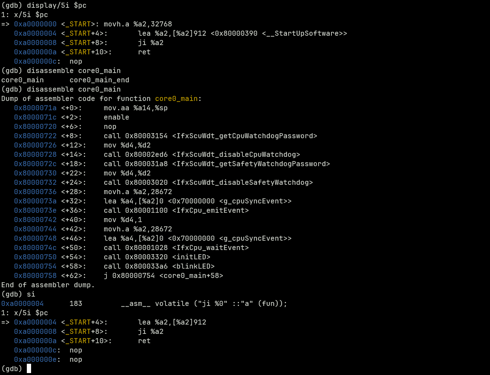
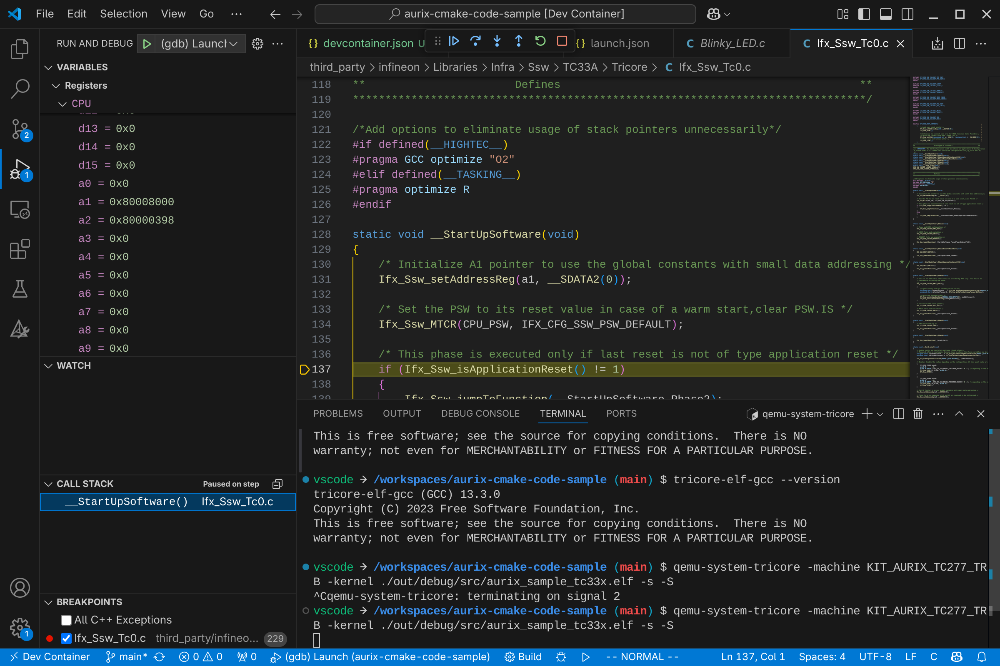

# Debug you software using QEMU + GDB

This toolchain provides `qemu-system-tricore` and `tricore-elf-gdb` for running
and debugging your code in a simulated environment.

> QEMU support for Tricore architecture is incomplete. It provides only basic
> CPU instruction decode (no interrupts or multi-core) and no peripheral is
> available. Only core architecture from tc1.3 up to tc1.6.2 is supported

## Setup

The code below uses ELF executable built from
[aurix-cmake-code-sample](https://github.com/NoMore201/aurix-cmake-code-sample)
in debug mode (no optimizations and debug symbols enabled). It should work with
any Tricore ELF file built with DWARF v3 debug symbols.

First step is to run QEMU providing the ELF executable, enabling gdb stub for
remote debugging and enable startup freeze option to be able to connect before
running the emulation.

```
$ qemu-system-tricore -machine KIT_AURIX_TC277_TRB -kernel ./out/debug/src/aurix_sample_tc33x.elf -s -S
```

Next we run tricore-elf-gdb, set the architecture version to 1.6.2 and connect
to QEMU gdb stub:

```
$ tricore-elf-gdb ./out/debug/src/aurix_sample_tc33x.elf

GNU gdb (GDB) 14.0.50.20230607-git
Copyright (C) 2023 Free Software Foundation, Inc.
License GPLv3+: GNU GPL version 3 or later <http://gnu.org/licenses/gpl.html>
This is free software: you are free to change and redistribute it.
There is NO WARRANTY, to the extent permitted by law.
Type "show copying" and "show warranty" for details.
This GDB was configured as "--host=x86_64-pc-linux-gnu --target=tricore-elf".
Type "show configuration" for configuration details.
For bug reporting instructions, please see:
<https://www.gnu.org/software/gdb/bugs/>.
Find the GDB manual and other documentation resources online at:
    <http://www.gnu.org/software/gdb/documentation/>.

For help, type "help".
Type "apropos word" to search for commands related to "word"...
Reading symbols from /mnt/c/git/aurix-cmake-code-sample/out/debug/src/aurix_sample_tc33x.elf...

(gdb) set architecture TriCore:V1_6_2
The target architecture is set to "TriCore:V1_6_2".

(gdb) target remote localhost:1234
Remote debugging using localhost:1234
Ifx_Ssw_jumpToFunction (fun=<optimized out>)
    at /home/nomore/Workspace/aurix-cmake-code-sample/third_party/infineon/Libraries/Infra/Ssw/TC33A/Tricore/Ifx_Ssw_CompilersGnuc.h:183
183         __asm__ volatile ("ji %0" ::"a" (fun));
```

Now you can start debugging your code through QEMU.



## Debugging through VSCode

When using VScode with C/C++ extension is it possible to directly run GDB from
the code editor and debug throught the GUI.

All you need to do is provide a custom `launch.json` configuration, making sure
to adjust `program` and `miDebuggerPath` according to your environment.

When using VS Code with the C/C++ extension, you can directly run GDB from the
code editor and debug through the GUI. Simply provide a custom `launch.json`
configuration, ensuring you adjust `program` and `miDebuggerPath` settings
to match your environment.

```json
{
    // make sure QEMU is running your executable with gdbstub enabled before
    // launching this
    "version": "0.2.0",
    "configurations": [
        {
            "name": "tricore-qemu-debug",
            "type": "cppdbg",
            "request": "launch",
            "program": "${workspaceFolder}/out/debug/src/aurix_sample_tc33x.elf",
            "args": [],
            "stopAtEntry": true,
            "cwd": "${fileDirname}",
            "environment": [],
            "externalConsole": false,
            "MIMode": "gdb",
            "miDebuggerPath": "/opt/tricore/bin/tricore-elf-gdb",
            "miDebuggerServerAddress": "localhost:1234",
            "setupCommands": [
                {
                    "description": "Enable pretty-printing for gdb",
                    "text": "-enable-pretty-printing",
                    "ignoreFailures": true
                },
                {
                    "description": "Set Disassembly Flavor to Intel",
                    "text": "-gdb-set architecture TriCore:V1_6_2",
                    "ignoreFailures": false
                }
            ]
        }

    ]
}
```


